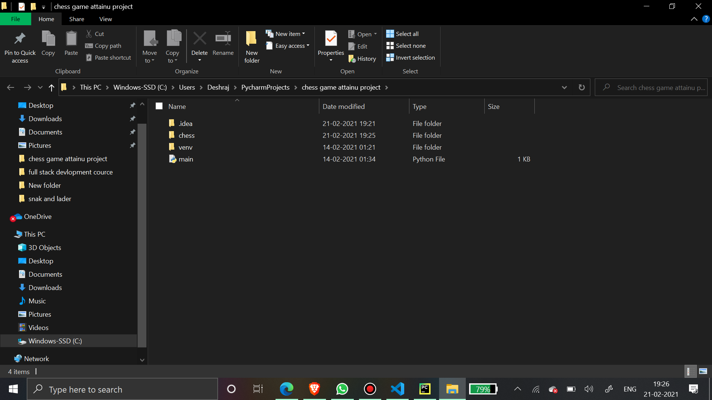
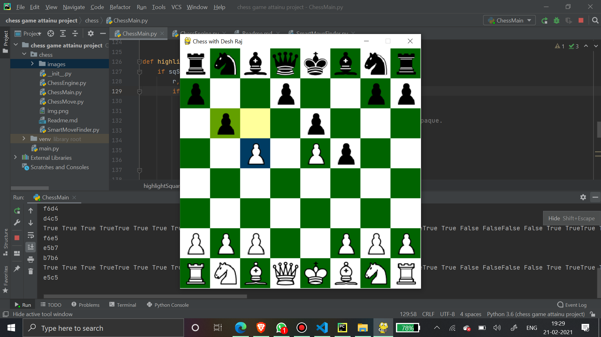

# Chess Game Project

This repo is for Chess game project made using Pygame, and it uses OOPs principles as there are classes for GUI.

It is just plain and simple 2 player chess but it supports all chess features like move validation,
Check-Checkmate-Stalemate detection, Pawn promotion, Castling and En-passant.

Apart from all valid chess logic, I have also added interactive GUI that lets user know which side is to make the move,
if a performed move is legal or not, events when check/checkmate/pawn promotion and stalemate occurs.

Requirements:
1) Python 3.6 or Python 3.9
2) Pygame

How to play:

Ensure that you have Python 3.6 or Python 3.9 and pygame installed. After that run ChessMain.py using terminal,
or a python IDE such as Visual studio code or Pycharm.
Note :- you have to pest Chess game attainu project repository at your pycharm project section example:-
 or C:\Users\Deshraj\PycharmProjects\chess game Attain-U project
after that run ChessMain.py file.
Now you can pLay a Chess Game. for eg- check 

Thank you